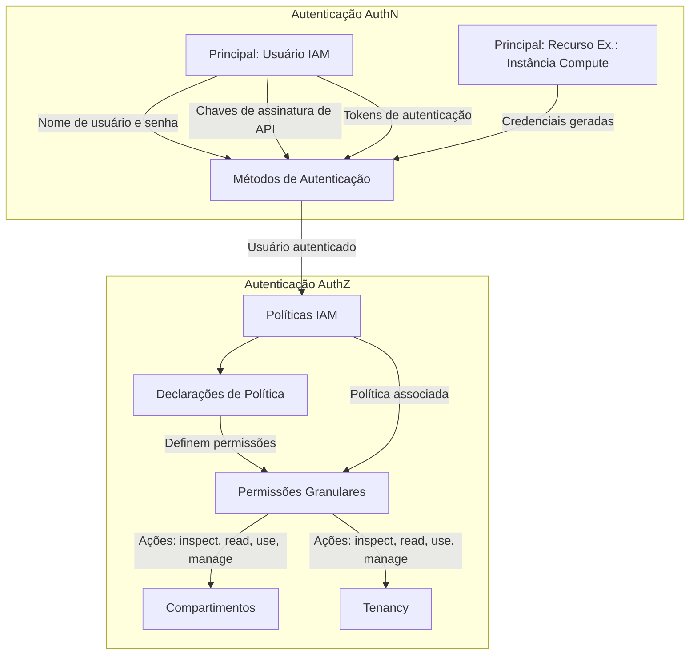

[⬅️ Voltar para o README](../README.md)

# Autenticação e Autorização no OCI

No Oracle Cloud Infrastructure (OCI), um **principal** é uma entidade de IAM que tem permissão para interagir com recursos. Existem dois tipos principais de principais:

1. **IAM Users** (Usuários criados no IAM).  
2. **Principal Resources** (recursos que agem como entidades, como instâncias de computação).

---

## **Autenticação (AuthN)**

Autenticação responde à pergunta: **"Você é quem diz ser?"**

Métodos comuns de autenticação no OCI incluem:
- Nome de usuário e senha.
- Chaves de assinatura de API.
- Tokens de autenticação.

---

## **Autorização (AuthZ)**

Autorização determina: **"O que você está autorizado a fazer?"**

No OCI, a autorização é gerenciada por meio de **políticas**. Estas são declarações legíveis para humanos que definem permissões granulares. As políticas podem ser vinculadas a um compartimento ou à tenancy.

> **Nota:** Tudo é negado por padrão no OCI.

### **Exemplo Visual: Autenticação e Autorização no OCI**
Aqui está um diagrama que descreve como a autenticação (AuthN) e a autorização (AuthZ) funcionam no Oracle Cloud Infrastructure:


### Exemplo de Declaração de Política

```text
Allow group <group_name> to <verb> <resource_type> in <location> [where <conditions>]
```

---

## **Componentes de uma Declaração de Política IAM**

1. **Localização:** define onde a política se aplica (compartimento ou tenancy).  
2. **Ação:** o verbo específico que permite a ação (e.g., `inspect`, `read`, `use`, `manage`).  
3. **Recurso:** o tipo de recurso em que a ação pode ser realizada.  
4. **Principal:** o grupo ao qual a política se aplica.  
5. **Condições:** condições opcionais para restringir a política.

---

### **Verbos das Políticas**

Os verbos das políticas determinam o nível de controle:
- `inspect`: visualização básica de informações do recurso.
- `read`: visualização mais detalhada do recurso.
- `use`: permite operações limitadas no recurso.
- `manage`: acesso completo, incluindo criação e exclusão.


---

### **Tipos de Recursos nas Políticas**

Cada política especifica os tipos de recursos aos quais ela se aplica:
- Exemplo: `instance`, `volume`, `vcn`, `bucket`.


